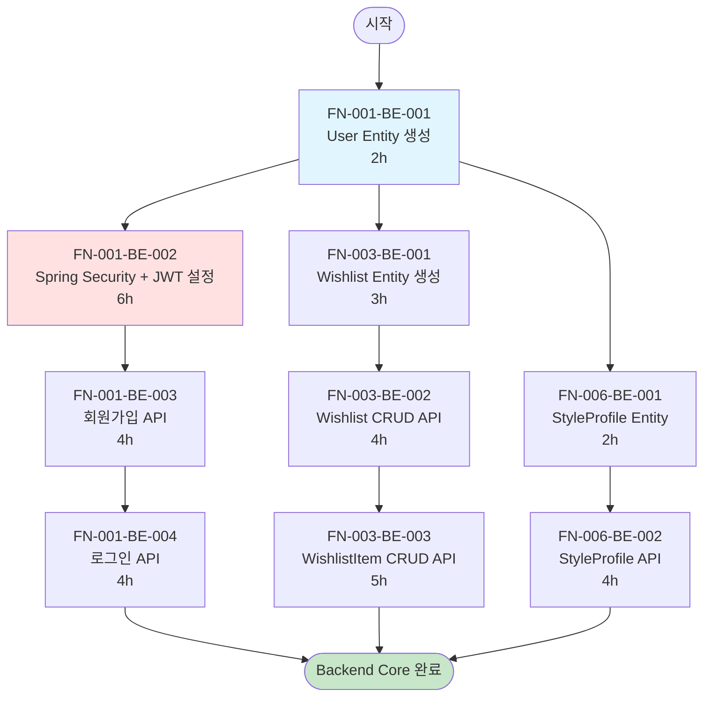
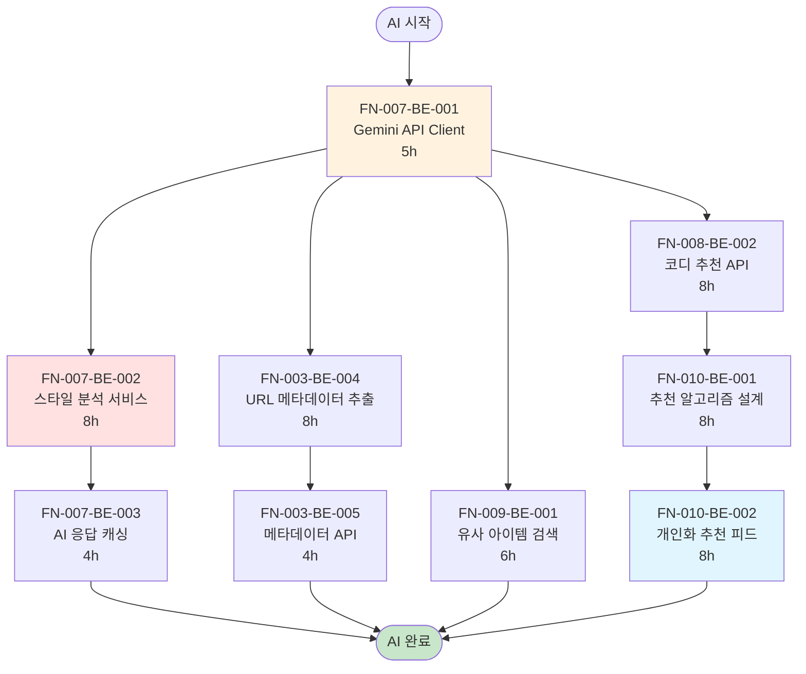
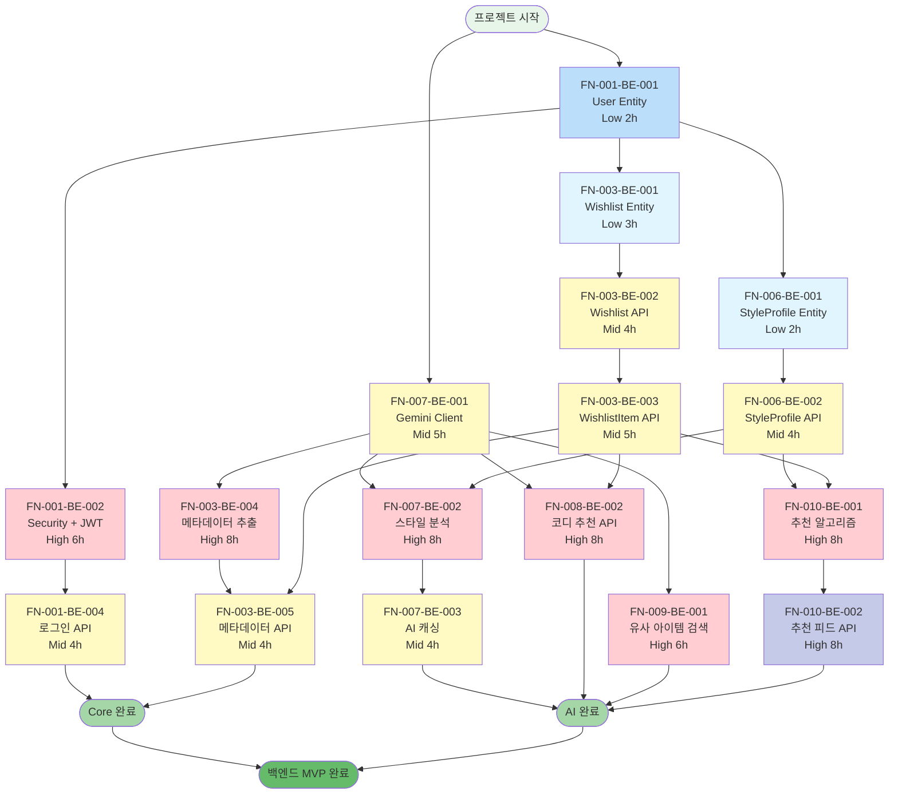

# Backend Task Dependency Graph (DAG)

**프로젝트:** Closet Canvas Backend  
**작성일:** 2025-12-07

---

## 📋 개요

이 문서는 백엔드 43개 Task 중 핵심 14개를 선별하여 의존성 그래프(DAG)로 시각화합니다. 
"Backend Core" 흐름은 기본 인증/DB/API 구축을, "AI/Recommendation" 흐름은 AI 통합 및 추천 시스템 구현을 나타냅니다.
두 흐름은 병렬로 진행 가능하며, 일부 Task에서 합류합니다.

---

## 🗺️ Backend Core Flow

**목표:** 사용자 인증, 위시리스트 CRUD, 스타일 프로필 저장



---

## 🤖 AI/Recommendation Flow

**목표:** Gemini API 연동, 스타일 분석, 메타데이터 추출, 추천 시스템



---

## 🔗 통합 의존성 그래프

**Backend Core + AI 통합 흐름**



---

## 📊 선별된 Task 목록 (14개)

### Backend Core (7개)

| Task ID | Title | 난이도 | 시간 | 선행 작업 |
|---------|-------|--------|------|----------|
| **FN-001-BE-001** | User Entity 생성 | Low | 2h | - |
| **FN-001-BE-002** | Spring Security + JWT | High | 6h | FN-001-BE-001 |
| **FN-001-BE-004** | 로그인 API | Mid | 4h | FN-001-BE-002 |
| **FN-003-BE-001** | Wishlist Entity | Low | 3h | FN-001-BE-001 |
| **FN-003-BE-002** | Wishlist API | Mid | 4h | FN-003-BE-001 |
| **FN-003-BE-003** | WishlistItem API | Mid | 5h | FN-003-BE-002 |
| **FN-006-BE-001** | StyleProfile Entity | Low | 2h | FN-001-BE-001 |
| **FN-006-BE-002** | StyleProfile API | Mid | 4h | FN-006-BE-001 |

**소계:** 8개, 30시간

### AI/Recommendation (6개)

| Task ID | Title | 난이도 | 시간 | 선행 작업 |
|---------|-------|--------|------|----------|
| **FN-007-BE-001** | Gemini API Client | Mid | 5h | - |
| **FN-007-BE-002** | 스타일 분석 서비스 | High | 8h | FN-007-BE-001, FN-006-BE-002 |
| **FN-007-BE-003** | AI 응답 캐싱 | Mid | 4h | FN-007-BE-002 |
| **FN-003-BE-004** | URL 메타데이터 추출 | High | 8h | FN-007-BE-001 |
| **FN-008-BE-002** | 코디 추천 API | High | 8h | FN-007-BE-001, FN-003-BE-003 |
| **FN-010-BE-001** | 추천 알고리즘 설계 | High | 8h | FN-006-BE-002, FN-003-BE-003 |
| **FN-010-BE-002** | 추천 피드 API | High | 8h | FN-010-BE-001 |

**소계:** 7개, 49시간

**전체:** 14개 핵심 Task, 79시간 (약 2개월)

---

## 🔍 Critical Path 분석

### 가장 긴 경로 (Critical Path)

```
Start 
  → FN-001-BE-001 (2h)
  → FN-001-BE-002 (6h)
  → FN-001-BE-004 (4h)
Total: 12시간 (인증 완료)

병렬로:
Start
  → FN-007-BE-001 (5h)
  → FN-007-BE-002 (8h)
  → FN-007-BE-003 (4h)
Total: 17시간 (AI 완료)

최종 병합:
  → FN-010-BE-001 (8h)
  → FN-010-BE-002 (8h)
Total: 33시간 (전체 완료)
```

**Critical Path:** 약 45시간 (병렬 작업 고려 시)

---

## 🎯 실행 전략

### Week 1-2: Backend Core 집중
```
Day 1-2:  FN-001-BE-001, FN-001-BE-002 (8h)
Day 3-4:  FN-001-BE-004, FN-003-BE-001 (7h)
Day 5-6:  FN-003-BE-002, FN-003-BE-003 (9h)
Day 7-8:  FN-006-BE-001, FN-006-BE-002 (6h)
```

### Week 3-4: AI 통합
```
Day 1-2:  FN-007-BE-001, FN-007-BE-002 (13h)
Day 3-4:  FN-007-BE-003, FN-003-BE-004 (12h)
Day 5-6:  FN-008-BE-002, FN-009-BE-001 (14h)
Day 7-8:  FN-010-BE-001, FN-010-BE-002 (16h)
```

---

## 💡 병렬 작업 기회

다음 Task들은 동시에 진행 가능합니다:

### 그룹 A (User 기반)
- FN-001-BE-001 완료 후
  - FN-003-BE-001 (Wishlist)
  - FN-006-BE-001 (StyleProfile)

### 그룹 B (AI 기반)
- FN-007-BE-001 완료 후
  - FN-007-BE-002 (스타일 분석)
  - FN-003-BE-004 (메타데이터)
  - FN-008-BE-002 (코디 추천)
  - FN-009-BE-001 (유사 검색)

**2명이 작업 시 개발 기간 50% 단축 가능!**

---

## 📝 범례

### 난이도별 색상
- 🟦 **파란색** (Low): 2-3시간, 기본 CRUD/Entity
- 🟨 **노란색** (Mid): 4-5시간, API 구현/통합
- 🟥 **빨간색** (High): 6-8시간, 복잡한 로직/AI

### 완료 상태
- 🟢 **초록색**: 완료 지점
- ⚪ **흰색**: 일반 Task

---

**문서 버전:** 1.0  
**작성자:** Backend Team  
**기반 문서:** [21_BE_TASKS_FULL.md](./21_BE_TASKS_FULL.md)

