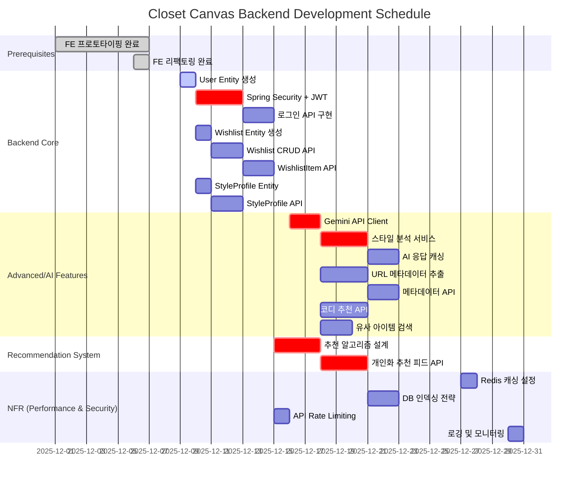

# Backend Development Gantt Chart

**프로젝트:** Closet Canvas Backend  
**작성일:** 2025-12-07  
**계획 기간:** 4주 (2025-12-07 ~ 2026-01-04)

---

## 📅 일정 전략

이 Gantt 차트는 **Backend Core를 먼저 완성한 후, AI/Advanced 기능을 병렬로 진행**하는 전략을 따릅니다. 
Week 1-2는 인증/위시리스트/스타일 프로필 등 기본 API를 구축하여 프론트엔드와 연동 가능한 상태를 만들고,
Week 3-4는 Gemini AI 통합, 메타데이터 추출, 추천 알고리즘 등 고급 기능을 추가합니다.
병렬 작업이 가능한 Task들은 겹치는 기간으로 배치하여 개발 기간을 단축했습니다.

---

## 🗓️ Gantt Chart



---

## 📊 일정 상세

### Week 1 (2025-12-09 ~ 12-15): Backend Core 기반 구축

**월요일 (12/9)**
- ✅ FN-001-BE-001: User Entity 생성 (1일)

**화요일-목요일 (12/10-12)**
- ✅ FN-001-BE-002: Spring Security + JWT 설정 (3일) 🔴 Critical

**금요일-토요일 (12/13-14)**
- ✅ FN-001-BE-004: 로그인 API (2일)

**병렬 작업 (12/10부터):**
- ✅ FN-003-BE-001: Wishlist Entity (1일)
- ✅ FN-006-BE-001: StyleProfile Entity (1일)

**주간 완료:** 인증 시스템 완성, Entity 준비

---

### Week 2 (2025-12-16 ~ 12-22): Core API 구현 + AI 시작

**월요일-화요일 (12/16-17)**
- ✅ FN-003-BE-002: Wishlist CRUD API (2일)

**수요일-목요일 (12/18-19)**
- ✅ FN-003-BE-003: WishlistItem API (2일)

**금요일-토요일 (12/20-21)**
- ✅ FN-006-BE-002: StyleProfile API (2일)

**병렬 작업 (12/16부터):**
- ✅ FN-007-BE-001: Gemini API Client (2일) 🔴 Critical

**주간 완료:** 기본 CRUD 완성, AI 준비

---

### Week 3 (2025-12-23 ~ 12-29): AI 통합 및 고급 기능

**월요일-수요일 (12/23-25)**
- ✅ FN-007-BE-002: 스타일 분석 서비스 (3일) 🔴 Critical

**목요일-금요일 (12/26-27)**
- ✅ FN-007-BE-003: AI 응답 캐싱 (2일)
- ✅ NF-001-BE-002: Redis 캐싱 설정 (1일)

**병렬 작업:**
- ✅ FN-003-BE-004: URL 메타데이터 추출 (3일, 12/23-25)
- ✅ FN-008-BE-002: 코디 추천 API (3일, 12/23-25)
- ✅ FN-009-BE-001: 유사 아이템 검색 (2일, 12/26-27)

**주간 완료:** AI 기능 완성

---

### Week 4 (2025-12-30 ~ 2026-01-04): 추천 시스템 + 품질 향상

**월요일-화요일 (12/30-31)**
- ✅ FN-003-BE-005: 메타데이터 API (2일)
- ✅ NF-005-BE-001: 로깅 및 모니터링 (1일)

**수요일-금요일 (1/1-3)**
- ✅ FN-010-BE-001: 추천 알고리즘 설계 (3일) 🔴 Critical

**토요일-월요일 (1/4-6)**
- ✅ FN-010-BE-002: 개인화 추천 피드 API (3일) 🔴 Critical

**병렬 작업:**
- ✅ NF-001-BE-001: DB 인덱싱 (2일, 1/2-3)
- ✅ NF-003-BE-001: API Rate Limiting (1일, 1/2)

**주간 완료:** MVP 완성! 🎉

---

## 📈 누적 진행 그래프

```
Week 1: ████████░░░░░░░░░░░░ 40% (Core 기반)
Week 2: ████████████████░░░░ 70% (Core 완료)
Week 3: ██████████████████░░ 85% (AI 통합)
Week 4: ████████████████████ 100% (추천 + NFR)
```

---

## 🎯 마일스톤

| 마일스톤 | 날짜 | 달성 기준 |
|----------|------|-----------|
| **M1: Auth Ready** | 2025-12-14 | 회원가입/로그인 API 동작 |
| **M2: Core API Complete** | 2025-12-21 | Wishlist, StyleProfile CRUD 완성 |
| **M3: AI Integration** | 2025-12-27 | Gemini 스타일 분석 동작 |
| **M4: MVP Launch** | 2026-01-04 | 추천 시스템 포함 전체 기능 동작 |

---

## 🔴 Critical Path Tasks

다음 Task들은 전체 일정에 직접 영향을 미칩니다:

1. **FN-001-BE-002** (Security + JWT) - 6h
2. **FN-007-BE-001** (Gemini Client) - 5h
3. **FN-007-BE-002** (스타일 분석) - 8h
4. **FN-010-BE-001** (추천 알고리즘) - 8h
5. **FN-010-BE-002** (추천 피드) - 8h

**Total Critical Path:** 35시간

---

## 💪 리소스 할당 전략

### 1명 작업 시 (기본)
- **Week 1-2:** Backend Core 집중
- **Week 3-4:** AI/Advanced 집중
- **총 기간:** 4주

### 2명 작업 시 (최적)
- **Person A:** Backend Core (FN-001, FN-003, FN-006)
- **Person B:** AI Features (FN-007, FN-008, FN-009)
- **총 기간:** 2.5주 (37% 단축)

### 3명 작업 시 (공격적)
- **Person A:** Auth + User (FN-001, FN-002)
- **Person B:** Wishlist + Closet (FN-003, FN-005)
- **Person C:** AI + Recommendation (FN-007, FN-008, FN-009, FN-010)
- **총 기간:** 2주 (50% 단축)

---

## 🎓 수요일 세션 시작 계획

### 12월 11일 (수) 세션

**목표:** FN-001-BE-001 완료
- User Entity 작성
- UserRepository 인터페이스
- 기본 테스트

**예상 시간:** 2시간  
**완료 기준:** 
- [ ] User.java 작성
- [ ] UserRepository.java 작성
- [ ] 애플리케이션 실행 성공
- [ ] JPA가 users 테이블 자동 생성 확인

---

## 📊 주간 작업량

| 주차 | Tasks | 시간 | 누적 |
|------|-------|------|------|
| Week 1 | 5개 | 16h | 16h |
| Week 2 | 4개 | 15h | 31h |
| Week 3 | 5개 | 22h | 53h |
| Week 4 | 5개 | 24h | 77h |

**4주 총 작업:** 77시간 (주당 약 19시간, 하루 3-4시간)

---

## 🚦 위험 요소 및 대응

### 잠재적 지연 요인

| 위험 | 확률 | 영향 | 대응 방안 |
|------|------|------|-----------|
| JWT 설정 난이도 | High | 2-3일 지연 | 레퍼런스 코드 준비, 페어 프로그래밍 |
| Gemini API 연동 실패 | Mid | 1-2일 지연 | 테스트 키 미리 발급, 문서 숙지 |
| 메타데이터 파싱 어려움 | Mid | 2-3일 지연 | Jsoup 예제 준비, 주요 사이트 분석 |
| DB 설계 변경 | Low | 1일 지연 | Flyway 마이그레이션, 초기 ERD 검토 |

### 버퍼 타임

각 주차마다 **2-3일 버퍼**를 두어 예상치 못한 문제에 대응합니다.

---

## 🎯 다음 단계

1. **오늘 (12/7 토):** 문서 리뷰 및 환경 준비
2. **일요일 (12/8):** Spring Boot 프로젝트 생성, 초기 설정
3. **월요일 (12/9):** FN-001-BE-001 시작 (User Entity)
4. **수요일 (12/11):** 백엔드 세션 - FN-001-BE-002 시작

---

**문서 버전:** 1.0  
**작성자:** Backend Team  
**기반 문서:** [22_BE_TASK_DAG.md](./22_BE_TASK_DAG.md)

